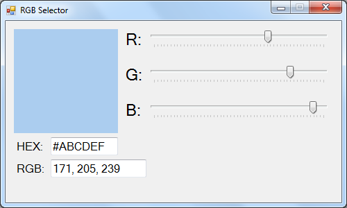

RGB Selector
==========

Simple tool to select a preferred color by `HEX` values or `RGB` values.

###How to use

1. Scroll the `RGB` scroll bars to get the color's `HEX` and `RGB` values.
2. Enter the `HEX` values of a color and get `RGB` values.
3. Enter the `RGB` values of a color and get `HEX` values.

###Others

This project can be a good example for those who are new to `Windows Forms` in `C#`.

This project is last modified in 2015.8.30, and uploaded afterwards.